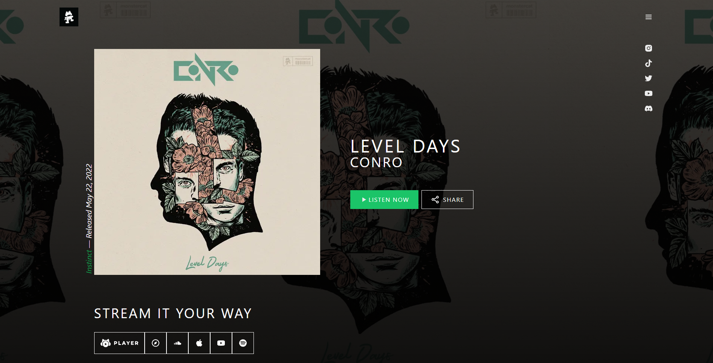
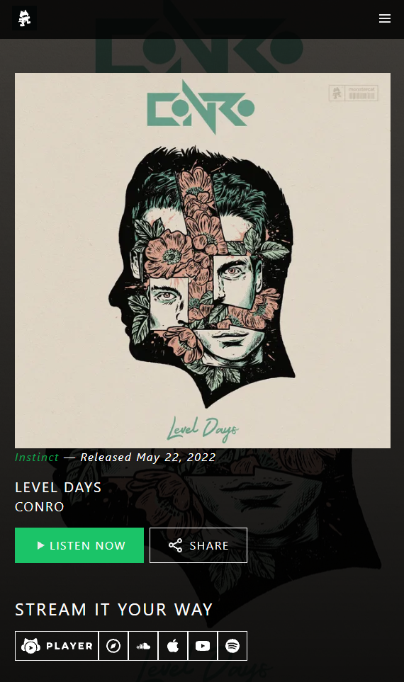

# MonsterCat

## Preview

### Desktop

### Mobile

## Deployed Version

* [Link]( https://monster-cat.vercel.app/)

## Setup

* Open index.html with live server
* [Link to download live server for VScode]( https://marketplace.visualstudio.com/items?itemName=ritwickdey.LiveServer)

## Description of project (spec / MVP)

### Outline
This project is designed to reinforce your HTML and CSS understanding, by recreating a static version of a monster cat website.
Getting images and correct colour by inspecting elements is allowed but copying stylings and html tree is not.

### MVP:
  - Recreate the look of the website without inspecting element for layout aspects of the website -- [x]
  - Recreate the mobile responsiveness similar to the original website -- [x]
  - Has a mobile menu -- [x]
 

## Approach
* A mobile first approach was done when styling the elements, where the page will be styled for mobile first then desktop.
* Worked on the website from top to bottom, doing the header first then working my way down to the footer.
* Most of the layout of elements was done with flexbox.
* This project caused me to research various CSS properties such as position absolute/relative to position elements in specific spots on the screen, z-index was another style used to decide which elements had overlap priority.
* Styling was done with tailwindCSS which uses utility classes to style elements. 

## Reflection
* What went well?
  - I think the vibe of the page was really recreated when comparing this copy to the original.
* What are you proud of? 
  - I am proud of how fast I was able to pick up tailwindCSS only using it a few times, the utility classes approach I think really resonates with me.
* What was a challenge?
  - I found re-creating certain style effects a little challenging but was easily resolved through research about the effect that links to the property. Example overlapping the mobile menu by changing the z index style property.
* What you'd do differently?
  - Try and recreate this in react and add some functionality like making the play button play songs.

## Future Goals

* Re-create react.
* Add functionality on play buttons.
* Added multiple drop downs in the mobile menu

## Further reading or links to inspiration

*  [Tailwindcss]( https://tailwindcss.com/docs/installation)
*  [Flex box]( https://css-tricks.com/snippets/css/a-guide-to-flexbox/)
*  [Mobile First Design]( https://www.browserstack.com/guide/how-to-implement-mobile-first-design#:~:text=Mobile%2DFirst%20Approach-,What%20is%20Mobile%2DFirst%20Design%3F,up%20to%20larger%20screen%20sizes.)

## Stay in touch

*  [Portfolio]( https://edric-khoo.vercel.app/)
*  [Linkedin]( https://www.linkedin.com/in/edric-khoo-98881b173/)

